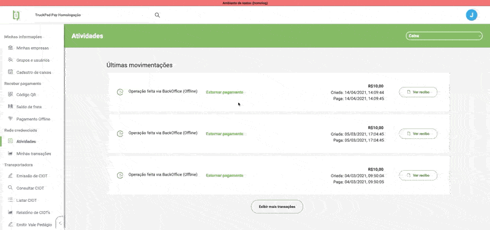

Logado na plataforma Truckpad com suas credenciais de `backoffice` você terá que selecionar a transportadora que deseja alterar as taxas.

Uma selecionada vamos para o menu lateral, aonde iremos na seguinte opção `Backoffice` > `Transportadora` > `Parâmetro da conta`

